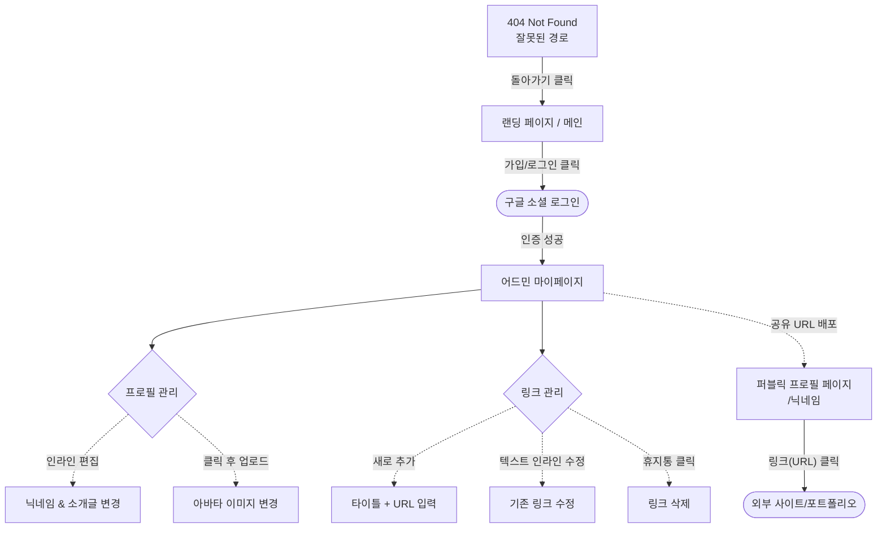

# 마이링크 (MyLink) 화면 와이어프레임 (Wireframes)

본 문서는 PRD 및 사용자 시나리오를 바탕으로 구성된 마이링크의 핵심 화면 와이어프레임입니다. 머메이드(Mermaid) 다이어그램을 통한 플로우와 아스키아트(ASCII Art) 스타일의 스크린 레이아웃을 포함합니다.

---

## 1. 유저 플로우 구조도 (User Flow)



---

## 2. 모바일 반응형 아스키아트 와이어프레임 (핸드폰/태블릿 최적화 레이아웃 중심)

모든 UI는 shadcn/ui 기반으로, 모바일 우선(Mobile-First) 디자인을 상정하여 아스키아트로 도식화되었습니다.

### 2.1 메인 랜딩 (로그인 화면)

```text
+-----------------------------------------+
|                  MyLink          [메뉴] |
+-----------------------------------------+
|                                         |
|                                         |
|    당신의 모든 링크를 단 하나의 페이지로    |
|                                         |
|    개발자와 크리에이터를 위한 심플하고      |
|    오픈소스 기반의 프로필 서비스.           |
|                                         |
|    +-------------------------------+    |
|    |  [G] 구글 계정으로 시작하기     |    |
|    +-------------------------------+    |
|                                         |
|                                         |
+-----------------------------------------+
```

### 2.2 마이페이지 (어드민 대시보드) - 인라인 편집 UI

```text
+-----------------------------------------+
| [MyLink 로고]                [로그아웃] |
+-----------------------------------------+
| 내 링크 주소: mylink.com/nick_name [복사] |
+-----------------------------------------+
|                                         |
|           +---------------+             |
|           |   [아바타]    |             |
|           |  (업로드 됨)  |             |
|           +---------------+             |
|                                         |
|   닉네임: [ nick_name ✎     ]           |
|                                         |
|   소개글:                               |
|   [ 프론트엔드 개발자 및 기술 블로거입니다. |
|     현재 새 포트폴리오 준비 중! ✎      ]  |
|                                         |
| +-------------------------------------+ |
| |  [+] 새로운 링크 추가 버튼          | |
| +-------------------------------------+ |
|                                         |
| ======================================= |
| | (G) | [Github Profile ✎]      [🗑️] | |
| |     | URL: https://github... ✎    | |
| ======================================= |
| | (V) | [Velog Tech Blog ✎]     [🗑️] | |
| |     | URL: https://velog... ✎     | |
| ======================================= |
+-----------------------------------------+
```
*(기획서에 명시된 대로 별도 모달창 없이 텍스트(`✎`)를 클릭해서 즉시 인라인 수정이 가능합니다.)*

### 2.3 퍼블릭 페이지 (방문자 접속)

```text
+-----------------------------------------+
|                                         |
|           +---------------+             |
|           |               |             |
|           |   [아바타]    |             |
|           |               |             |
|           +---------------+             |
|                                         |
|              nick_name                  |
|                                         |
|    "프론트엔드 개발자 및 기술 블로거입니다. |
|     현재 새 포트폴리오 준비 중!"          |
|                                         |
|                                         |
|   +---------------------------------+   |
|   |  (G) Github Profile             |   |
|   +---------------------------------+   |
|                                         |
|   +---------------------------------+   |
|   |  (V) Velog Tech Blog            |   |
|   +---------------------------------+   |
|                                         |
|                                         |
|                                         |
|        POWERED BY MyLink                |
+-----------------------------------------+
```

### 2.4 커스텀 404 에러 화면 (잘못된 URL 접근)

```text
+-----------------------------------------+
|                  MyLink                 |
+-----------------------------------------+
|                                         |
|                                         |
|             🤔 404 Error                |
|                                         |
|       존재하지 않는 프로필 페이지입니다.      |
|    URL이 올바른지 다시 한 번 확인해 주세요.    |
|                                         |
|                                         |
|    +-------------------------------+    |
|    |       홈으로 돌아가기           |    |
|    +-------------------------------+    |
|                                         |
|                                         |
+-----------------------------------------+
```

---

## 💡 개발 및 UX 관점 개선 제안 (추가 아이디어)

기획서(PRD)와 사용자 시나리오 구조를 검토하며, 와이어프레임 설계 단계에서 **몇 가지 사용자 경험 향상을 위한 추가 개선점**이 보여 제안합니다.

1. **상단 URL 빠른 복사 버튼 추가 (어드민)**
   * 마이페이지 설계 중 고려해본 결과, 내 링크 주소를 복사해 인스타그램, 깃허브 등에 붙여넣기 할 수 있게 돕는 가장 직관적인 **클립보드 복사 버튼**이 대시보드 상단에 배치되면 훨씬 편리할 것입니다.
2. **오프라인 네트워킹을 위한 QR 코드 공유 위젯**
   * 퍼블릭 링크 모달이나 어드민 화면에서 **내 URL에 해당하는 QR코드를 표출**시켜주면, 오프라인(예: 개발자 컨퍼런스)에서 명함 대신 즉각적인 스캔 공유가 가능해져 유용성이 매우 높아집니다.
3. **Skeleton UI (스켈레톤 로딩) 도입**
   * 구글 파비콘 API 사용 시, Favicon 이미지를 외부 통신으로 가져와야 하므로 약간의 로딩 딜레이가 생길 수 있습니다. 이미지가 뜨기 전까지 스켈레톤 로딩(회색 박스)을 적용해 깜빡임을 최소화하여 체감 성능을 향상시키는 것이 좋습니다.
